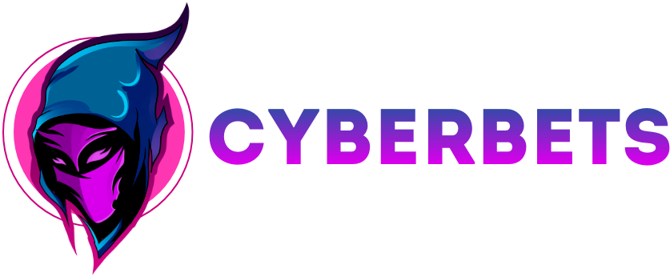

<p align="center"></p> 
   

<p align="center"></p> 

## <p>Description</p>
This project is an e-sports betting that focuses on the most popular cyber disciplines. The client has access to bets on a wide range of events, as well as on specific outcomes of each. This system is not focused on static odds, but works on the principle of dynamically changing odds, depending on the activity of users' bets on a particular outcome. Convenient system for analyzing platform statistics, setting teams, leagues, fine-tuning of events is also available. The user functionality supports viewing events, all kinds of actions with bets, the history of actions on the platform, setting up an account and much, much more.  *```The devil is in the details...```*
## <p>Stack</p>
#### Backend
- Java 16
- Jakarta EE 8.0 (JSP/ SERVLETS / JSTL)
- Slf4j/Log4j2
- Apache Commons Lang 3
- Google GSON
- Password4j
- Database - PostgreSQL 

#### Fronted
- Plain Html/CSS + Bootstrap 5.0
- JS/JQuery,  + Fetch/Ajax interaction
- Libraries / Plugins (DayJS, GridJS, NotifyJS, ChartJS,PayformJS, SelectPicker, ~~JQuery i18n~~)

## Docs

* [Database Schema](docs/DOCS.md)

